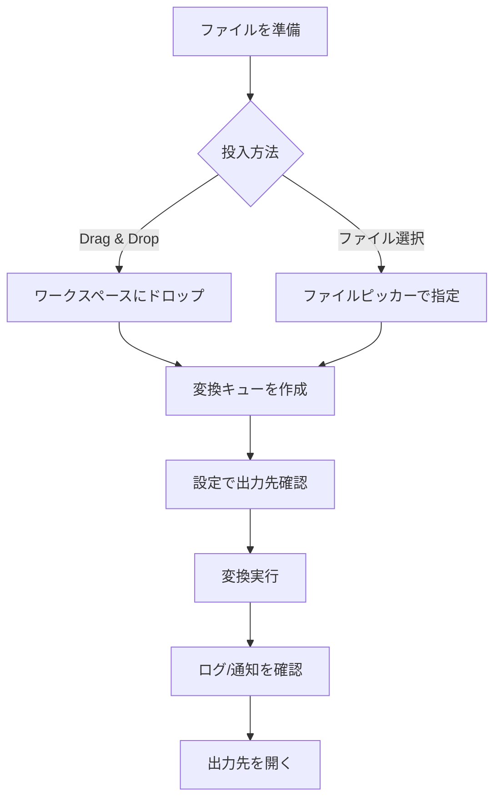

# Divitage 要件定義書

## 1. 目的
Divitage はファイルまたはフォルダをドラッグ＆ドロップするだけで安全にバッチ変換を行うツールであり、Windows 版 (WinUI 3)、macOS 版 (SwiftUI)、Linux 版 (Qt 6) で同等の機能を提供する。

## 2. スコープ
- Windows 版: `win/DivitageWinUI` 以下の WinUI 3 アプリ (Windows 11 以降を対象)。
- macOS 版: `mac/DivitageMacApp` 以下の SwiftUI アプリ。
- Linux 版: `linux/DivitageLinuxApp` 以下の Qt 6 + C++ アプリ。
- 共通ドキュメント: `docs/` 配下の Markdown (本ファイル / 設計書)。

## 3. 利用者
- 映像・画像・3D アセットなど大量のメディアをまとめて変換したいクリエイター。
- チーム内で統一された変換プロセスを配布したいリーダー／テクニカルアーティスト。

## 4. 用語
- **変換タスク**: 入力ファイル〜出力先のペアで表現される処理単位。
- **アクティビティログ**: 変換経過を時系列で示すログ表示。

## 5. 機能要件
| ID | カテゴリ | 要件 | プラットフォーム |
| --- | --- | --- | --- |
| FR-1 | 入力 | ファイル／フォルダのドラッグ＆ドロップ受け入れ | Win / Mac / Linux |
| FR-2 | 入力 | GUI でのファイルピッカーからの入力指定 | Win / Mac / Linux |
| FR-3 | 設定 | 出力先ディレクトリの永続化 | Win / Mac / Linux |
| FR-4 | 処理 | 変換キューを順次処理し、進捗をログ表示 | Win / Mac / Linux |
| FR-5 | UI | 使い方チュートリアル画面の表示 | Win / Mac / Linux |
| FR-6 | UI | 設定画面で一般設定 (起動時動作、テーマ) を編集 | Win / Mac / Linux |
| FR-7 | 品質 | 処理完了後の通知表示 (トースト/バナー) | Win / Mac / Linux |
| FR-8 | 品質 | 操作ショートカット (Win: Ctrl+Enter, Mac: Cmd+Enter, Linux: Ctrl+Enter) | Win / Mac / Linux |

## 6. 非機能要件
- NFR-1: 変換キュー 100 件を 1 分以内に受け付け UI がブロックしない。
- NFR-2: 主要操作はマウス／トラックパッドだけで完結し、キーボードショートカットで高速化可能。
- NFR-3: macOS 版は macOS 13 Ventura 以降、Apple Silicon / Intel 双方で動作。
- NFR-4: Windows 版 (WinUI 3) は Windows 11 22H2 以降 + Windows App SDK 1.5 を必須とし、モダンフルスクリーン / 高 DPI に最適化する。
- NFR-5: Linux 版 (Qt 6) は X11/Wayland の双方で動作し、CMake + Qt 公式バイナリでビルド可能とする。
- NFR-6: ログは 30 日を上限にローカル保存し、個人情報を保持しない。

## 7. ユーザーフロー

## 8. 成果物
- Windows 実行ファイル (WinUI 3)
- macOS 実行バイナリ / `.app`
- Linux 実行バイナリ
- 要件定義書 (本書)
- 設計書 (`docs/design.md`)
